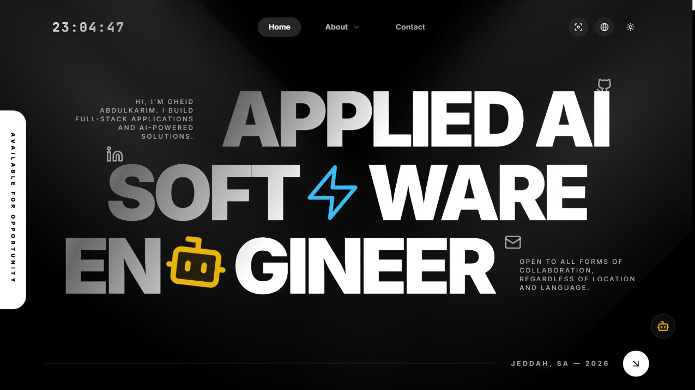

# غيد عبدالكريم — البورتفوليو

**مهندسة ذكاء اصطناعي ومطوّرة برمجيات.**

موقع تفاعلي بالعربية والإنجليزية يجمع مشاريعي وخبراتي وشهاداتي وأبحاثي، ويعرض التطبيقات والنماذج الأولية مع تفاصيلها ومعايناتها.

[زيارة الموقع](https://gheid-mycv.vercel.app/) · [المشاريع](https://gheid-mycv.vercel.app/projects) · [الأبحاث والأفكار](https://gheid-mycv.vercel.app/research) · [English](../README.md)



## ما الذي يقدّمه الموقع؟

- صفحات مشاريع تضم الوصف والتقنيات والصور والفيديو والمعاينة المباشرة حين يسمح الموقع بالتضمين.
- أبحاث ودراسات وأفكار، مع تحميل الملفات المتاحة وروابط الداشبورد المرافق.
- مساعد ذكاء اصطناعي للإجابة عن خلفيتي ومهاراتي وخبراتي ومشاريعي.
- واجهة عربية باتجاه RTL وإنجليزية، ووضع فاتح وداكن، وتخطيط متجاوب للجوال والكمبيوتر.
- خبرات مهنية وشهادات موثّقة، وسيرة ذاتية قابلة للتحميل، ونموذج تواصل بالبريد.
- تفاصيل تفاعلية ورسوم متحركة وعناصر ثلاثية الأبعاد وتجارب تقنيات تعتمد على الفيزياء.

## التقنيات

Next.js وReact وTypeScript وTailwind CSS للواجهة، مع Framer Motion وGSAP للحركة، وThree.js وReact Three Fiber وMatter.js للتفاعلات. يدعم PostgreSQL إدارة المحتوى عبر لوحة منفصلة، ويستخدم Groq أوGemini للمساعد وNodemailer للبريد.

## التشغيل

يتطلب Node.js 22 أو أحدث وnpm:

```bash
git clone https://github.com/iamghaid/gheid-mycv.git
cd gheid-mycv
npm install
npm run dev
```

افتح `http://localhost:3000`. يمكن تشغيل واجهة الموقع بالمحتوى المرفق دون قاعدة بيانات؛ الخدمات الخارجية تحتاج مفاتيحها الخاصة في ملف `.env.local` غير المنشور.

تفاصيل المتغيرات وبنية المشروع موجودة في [README الرئيسي](../README.md)، وخطوات إعداد لوحة الإدارة وقاعدة البيانات في [دليل CMS](CMS_SETUP.md).

## التواصل والترخيص

[LinkedIn](https://www.linkedin.com/in/gheid-abdulkarim-6567872ab/) · [GitHub](https://github.com/iamghaid) · [التواصل](https://gheid-mycv.vercel.app/contact)

الكود تحت [ترخيص MIT](../LICENSE) مع الحفاظ على إشعار حقوق القالب الأصلي. المستندات والشهادات والهوية البصرية والمواد الخارجية قد تخضع لحقوق منفصلة.
